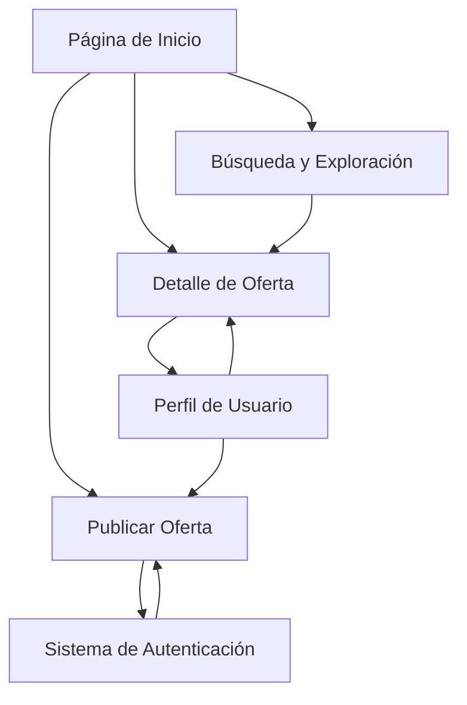

## 1. Product Overview
Plataforma comunitaria de ofertas y descuentos donde usuarios comparten y descubren promociones reales. Los consumidores ahorran dinero mientras construyen una comunidad de compradores inteligentes.

**Objetivo:** Crear la comunidad de ofertas más grande de habla hispana, enfocada en transparencia y contenido generado por usuarios reales.

## 2. Core Features

### 2.1 User Roles
| Role | Registration Method | Core Permissions |
|------|---------------------|------------------|
| Usuario Básico | Email o redes sociales | Ver ofertas, votar, comentar, guardar favoritos |
| Usuario Verificado | Verificación por actividad | Publicar ofertas, crear discusiones, acceso anticipado |
| Moderador | Designado por administradores | Moderar contenido, gestionar reportes, destacar ofertas |
| Admin | Sistema interno | Control total, analytics, configuración de plataforma |

### 2.2 Feature Module
Nuestra plataforma de ofertas comunitarias consta de las siguientes páginas principales:

1. **Página de Inicio**: Hero con slogan, navegación por categorías, listado de ofertas con filtros (Para ti, Más hot, Tendencias), sidebar con ofertas destacadas.

2. **Detalle de Oferta**: Información completa del producto, sistema de votos (hot/cold), comentarios y discusiones, botón para ir a la tienda, publicidad contextual.

3. **Publicar Oferta**: Formulario para compartir nuevas ofertas, selección de tipo (oferta, cupón, discusión), carga de imágenes y detalles.

4. **Perfil de Usuario**: Actividad del usuario, ofertas publicadas, puntos y recompensas, configuración de cuenta.

5. **Búsqueda y Exploración**: Búsqueda avanzada con filtros por categoría, precio, tienda, resultados con previews de ofertas.

### 2.3 Page Details
| Page Name | Module Name | Feature description |
|-----------|-------------|---------------------|
| Página de Inicio | Hero Section | Muestra slogan principal "Comunidad real, ahorros reales" con diseño atractivo y llamada a la acción |
| Página de Inicio | Navegación Categorías | Barra horizontal con categorías principales: Tecnología, Hogar, Moda, Alimentos, etc. con iconos personalizados |
| Página de Inicio | Filtros de Ofertas | Pestañas interactivas: Para ti (personalizado), Más hot (más votado), Tendencias (recientes), Todas (sin filtro) |
| Página de Inicio | Tarjetas de Ofertas | Display de productos con imagen, título, precio actual/anterior, descuento porcentaje, votos temperatura, autor y botón de acción |
| Página de Inicio | Sidebar Destacados | Widget lateral mostrando las 5 ofertas más populares del día con miniaturas y votos |
| Detalle de Oferta | Información Principal | Imagen ampliada del producto, título completo, precios con formato destacado, disponibilidad en tienda |
| Detalle de Oferta | Sistema de Votos | Botones Hot (rojo) y Cold (azul) con contador de votos, mostrando temperatura con icono de fuego o hielo |
| Detalle de Oferta | Sección de Comentarios | Lista de comentarios con autor, fecha, votos útiles, campo para agregar nuevo comentario con editor de texto |
| Detalle de Oferta | Acerca de la Oferta | Información del autor, fecha de publicación, descripción detallada, enlace directo a tienda con tracking |
| Publicar Oferta | Selector de Tipo | Cuatro opciones visuales: Oferta (producto), Cupón (código), Discusión (pregunta), Referido (bloqueado para nuevos) |
| Publicar Oferta | Formulario de Oferta | Campos para título, descripción, precio original/precio oferta, categoría, tienda, enlaces, imágenes con drag & drop |
| Publicar Oferta | Preview en Tiempo Real | Vista previa de cómo se verá la oferta antes de publicar con todos los elementos formateados |
| Perfil de Usuario | Estadísticas | Muestra puntos ganados, nivel en comunidad, ofertas publicadas, votos recibidos, fecha de unión |
| Perfil de Usuario | Tabs de Contenido | Navegación por: Ofertas publicadas, Comentarios hechos, Guardados, Seguidores/Siguiendo |
| Búsqueda y Exploración | Barra de Búsqueda | Búsqueda predictiva con sugerencias mientras escribe, historial de búsquedas recientes |
| Búsqueda y Exploración | Filtros Avanzados | Panel lateral con múltiples filtros: rango de precio, tiendas específicas, descuento mínimo, fecha de publicación |

## 3. Core Process

### Flujo de Usuario Regular:
1. Usuario llega a la página principal y ve ofertas destacadas
2. Puede explorar por categorías o usar la búsqueda para encontrar ofertas específicas
3. Al encontrar una oferta interesante, hace clic para ver detalles completos
4. Puede votar (hot/cold), comentar, guardar o ir directamente a la tienda
5. Si quiere contribuir, se registra y puede publicar sus propias ofertas

### Flujo de Publicación de Oferta:
1. Usuario registrado hace clic en "+ Publicar"
2. Selecciona tipo de contenido (oferta/cupón/discusión)
3. Completa formulario con información del producto/promoción
4. Agrega imágenes y enlaces relevantes
5. Revisa preview y confirma publicación
6. La oferta aparece en feed después de moderación automática

### Flujo de Moderador:
1. Accede a panel de moderación desde su perfil
2. Revisa reportes de usuarios sobre ofertas problemáticas
3. Puede editar, ocultar o eliminar contenido inapropiado
4. Destaca ofertas de calidad para mayor visibilidad
5. Gestiona spam y mantiene calidad de la comunidad

## 4. User Interface Design

### 4.1 Design Style
- **Colores Primarios**: Gris oscuro (#1e1f22) para fondos, Verde neón (#2BD45A) para acentos y CTAs
- **Colores Secundarios**: Blanco (#FFFFFF) para texto principal, Gris claro (#9CA3AF) para texto secundario
- **Estilo de Botones**: Rounded corners (8-12px), efectos hover sutiles, sombras suaves para profundidad
- **Tipografía**: Inter o Poppins para headers, sistema sans-serif moderno para body text
- **Tamaños de Fuente**: Headers 24-32px, body 14-16px, small text 12px
- **Estilo de Layout**: Card-based design con bordes redondeados, espaciado generoso (16-24px)
- **Iconos**: Estilo outline consistente, uso de emojis relevantes para categorías (🛒💻👕🍔)

### 4.2 Page Design Overview
| Page Name | Module Name | UI Elements |
|-----------|-------------|-------------|
| Página de Inicio | Header | Logo prominente a la izquierda, barra de búsqueda central, botones de acción derecha con iconografía moderna |
| Página de Inicio | Hero Section | Tipo grande en blanco sobre gradiente sutil, subtítulo más pequeño, CTA principal con botón verde prominente |
| Página de Inicio | Tarjetas de Ofertas | Diseño card con imagen 16:9, badge de votos circular con temperatura, precios con formato de moneda mexicana |
| Detalle de Oferta | Imagen Principal | Galería de imágenes con zoom hover, botón "Expandir" overlay en esquina superior derecha |
| Detalle de Oferta | Sistema de Votos | Botones grandes con iconos de fuego/hielo, contador prominente, animación de transición al votar |
| Publicar Oferta | Formulario | Inputs con labels flotantes, validación en tiempo real, drag & drop zone para imágenes con preview |

### 4.3 Responsiveness
- **Desktop-first approach**: Diseño optimizado para pantallas grandes (1440px+), experiencia completa con sidebar
- **Mobile adaptation**: Layout adaptativo para móviles con navegación inferior tipo app, tarjetas apiladas verticalmente
- **Touch optimization**: Botones mínimo 44x44px, gestos de swipe para navegación, modales full-screen en móvil
- **Breakpoints**: 320px (móvil), 768px (tablet), 1024px (desktop), 1440px+ (wide screen)

### 4.4 Animaciones y Microinteracciones
- **Loading states**: Skeleton screens para contenido asíncrono, spinners personalizados con logo
- **Hover effects**: Elevación de tarjetas, cambios de color en enlaces, tooltips informativos
- **Transitions**: Page transitions suaves (0.3s ease), modales con fade-in, notificaciones toast
- **Feedback visual**: Votos con animación de "pop", comentarios con indicador de envío, guardados con corazón que se llena