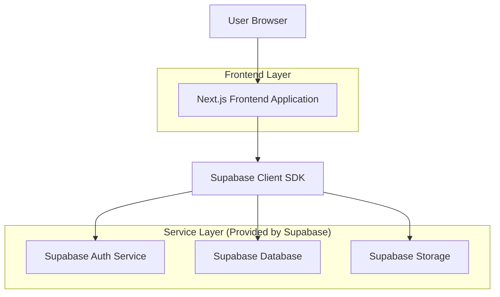
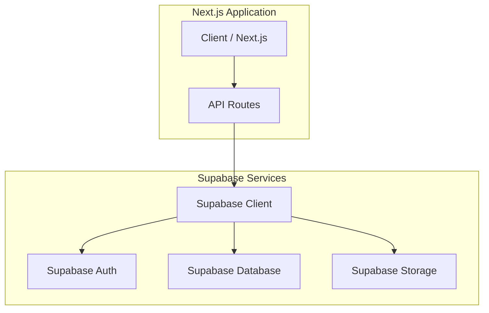
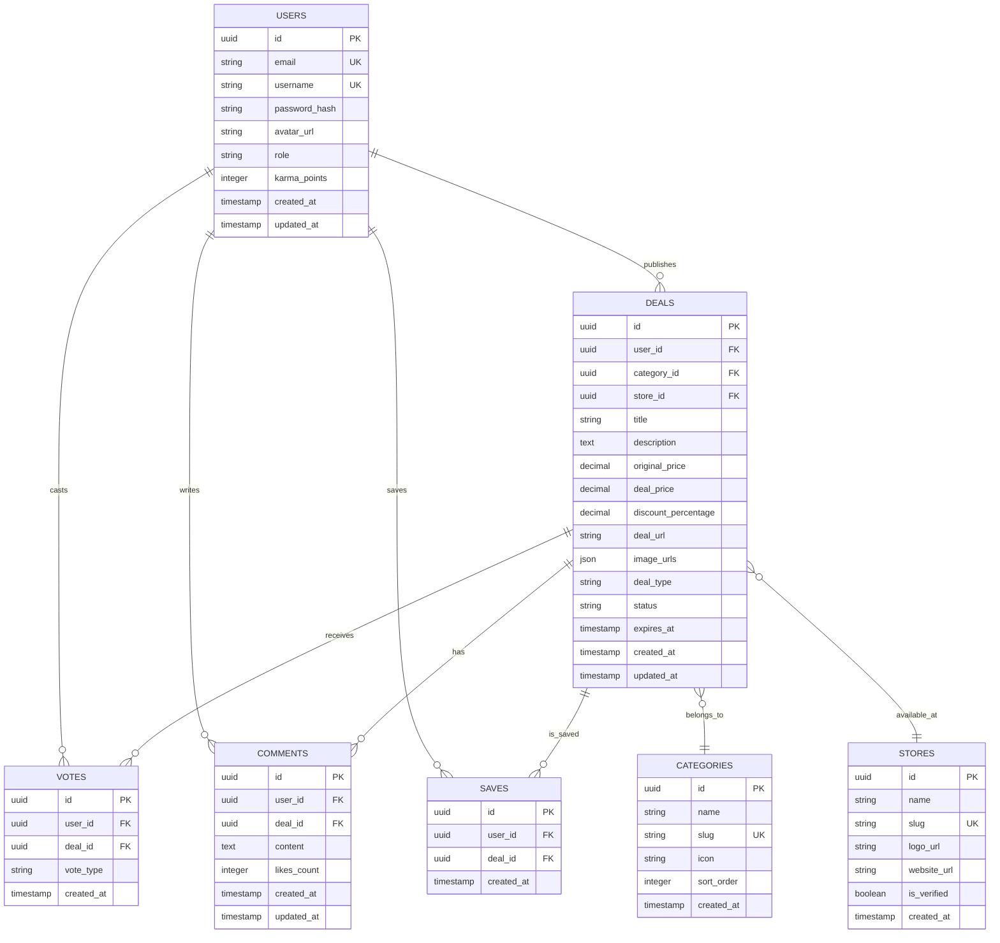

## 1. Architecture design



## 2. Technology Description

- **Frontend**: Next.js@14 + React@18 + TypeScript@5
- **Styling**: Tailwind CSS@3 + Headless UI
- **Package Manager**: pnpm
- **Initialization Tool**: create-next-app
- **Backend**: Supabase (BaaS)
- **Database**: PostgreSQL (via Supabase)
- **Authentication**: Supabase Auth
- **File Storage**: Supabase Storage

## 3. Route definitions

| Route | Purpose |
|-------|---------|
| `/` | Página de inicio con feed de ofertas y navegación principal |
| `/oferta/[id]` | Detalle de oferta específica con comentarios y votos |
| `/publicar` | Formulario para publicar nuevas ofertas/cupones/discusiones |
| `/buscar` | Página de búsqueda con filtros avanzados |
| `/categoria/[slug]` | Listado de ofertas por categoría específica |
| `/usuario/[username]` | Perfil público de usuario con su actividad |
| `/perfil` | Panel de configuración del perfil del usuario autenticado |
| `/auth/login` | Página de inicio de sesión |
| `/auth/register` | Página de registro de nuevos usuarios |
| `/auth/reset-password` | Recuperación de contraseña |

## 4. API definitions

### 4.1 Core API (via Supabase)

**Authentication Endpoints:**
```typescript
// Login
POST /auth/v1/token?grant_type=password

// Register
POST /auth/v1/signup

// Refresh Token
POST /auth/v1/token?grant_type=refresh_token
```

**Database Operations (via Supabase Client):**
```typescript
// Get deals with pagination and filters
const { data, error } = await supabase
  .from('deals')
  .select(`
    *,
    user:users(id, username, avatar_url),
    votes:votes(count),
    comments:comments(count)
  `)
  .eq('category', category)
  .order('created_at', { ascending: false })
  .range(start, end)

// Vote on deal
const { data, error } = await supabase
  .from('votes')
  .insert({
    deal_id: dealId,
    user_id: userId,
    vote_type: 'hot' | 'cold'
  })

// Add comment
const { data, error } = await supabase
  .from('comments')
  .insert({
    deal_id: dealId,
    user_id: userId,
    content: commentText
  })
```

## 5. Server architecture diagram



## 6. Data model

### 6.1 Data model definition



### 6.2 Data Definition Language

**Users Table:**
```sql
-- create table
CREATE TABLE users (
    id UUID PRIMARY KEY DEFAULT gen_random_uuid(),
    email VARCHAR(255) UNIQUE NOT NULL,
    username VARCHAR(50) UNIQUE NOT NULL,
    password_hash VARCHAR(255) NOT NULL,
    avatar_url TEXT,
    role VARCHAR(20) DEFAULT 'user' CHECK (role IN ('user', 'verified', 'moderator', 'admin')),
    karma_points INTEGER DEFAULT 0,
    created_at TIMESTAMP WITH TIME ZONE DEFAULT NOW(),
    updated_at TIMESTAMP WITH TIME ZONE DEFAULT NOW()
);

-- create indexes
CREATE INDEX idx_users_username ON users(username);
CREATE INDEX idx_users_karma ON users(karma_points DESC);
```

**Categories Table:**
```sql
-- create table
CREATE TABLE categories (
    id UUID PRIMARY KEY DEFAULT gen_random_uuid(),
    name VARCHAR(100) NOT NULL,
    slug VARCHAR(100) UNIQUE NOT NULL,
    icon VARCHAR(50),
    sort_order INTEGER DEFAULT 0,
    created_at TIMESTAMP WITH TIME ZONE DEFAULT NOW()
);

-- insert initial categories
INSERT INTO categories (name, slug, icon, sort_order) VALUES
('Tecnología', 'tecnologia', '💻', 1),
('Hogar', 'hogar', '🏠', 2),
('Moda', 'moda', '👕', 3),
('Alimentos', 'alimentos', '🍔', 4),
('Salud y Belleza', 'salud-belleza', '💊', 5),
('Entretenimiento', 'entretenimiento', '🎮', 6),
('Viajes', 'viajes', '✈️', 7),
('Deportes', 'deportes', '⚽', 8);
```

**Deals Table:**
```sql
-- create table
CREATE TABLE deals (
    id UUID PRIMARY KEY DEFAULT gen_random_uuid(),
    user_id UUID REFERENCES users(id) ON DELETE CASCADE,
    category_id UUID REFERENCES categories(id) ON DELETE CASCADE,
    store_id UUID REFERENCES stores(id) ON DELETE SET NULL,
    title VARCHAR(255) NOT NULL,
    description TEXT,
    original_price DECIMAL(10,2),
    deal_price DECIMAL(10,2),
    discount_percentage DECIMAL(5,2),
    deal_url TEXT NOT NULL,
    image_urls JSONB DEFAULT '[]',
    deal_type VARCHAR(20) DEFAULT 'deal' CHECK (deal_type IN ('deal', 'coupon', 'discussion')),
    status VARCHAR(20) DEFAULT 'active' CHECK (status IN ('active', 'expired', 'deleted')),
    expires_at TIMESTAMP WITH TIME ZONE,
    created_at TIMESTAMP WITH TIME ZONE DEFAULT NOW(),
    updated_at TIMESTAMP WITH TIME ZONE DEFAULT NOW()
);

-- create indexes
CREATE INDEX idx_deals_category ON deals(category_id);
CREATE INDEX idx_deals_user ON deals(user_id);
CREATE INDEX idx_deals_created_at ON deals(created_at DESC);
CREATE INDEX idx_deals_discount ON deals(discount_percentage DESC);
CREATE INDEX idx_deals_status ON deals(status) WHERE status = 'active';
```

**Votes Table:**
```sql
-- create table
CREATE TABLE votes (
    id UUID PRIMARY KEY DEFAULT gen_random_uuid(),
    user_id UUID REFERENCES users(id) ON DELETE CASCADE,
    deal_id UUID REFERENCES deals(id) ON DELETE CASCADE,
    vote_type VARCHAR(10) NOT NULL CHECK (vote_type IN ('hot', 'cold')),
    created_at TIMESTAMP WITH TIME ZONE DEFAULT NOW(),
    UNIQUE(user_id, deal_id)
);

-- create indexes
CREATE INDEX idx_votes_deal ON votes(deal_id);
CREATE INDEX idx_votes_user ON votes(user_id);
```

**Row Level Security (RLS) Policies:**
```sql
-- Enable RLS on tables
ALTER TABLE deals ENABLE ROW LEVEL SECURITY;
ALTER TABLE comments ENABLE ROW LEVEL SECURITY;
ALTER TABLE votes ENABLE ROW LEVEL SECURITY;
ALTER TABLE saves ENABLE ROW LEVEL SECURITY;

-- Basic read access for anonymous users
CREATE POLICY "Anyone can view active deals" ON deals
    FOR SELECT USING (status = 'active');

-- Authenticated users can create content
CREATE POLICY "Authenticated users can create deals" ON deals
    FOR INSERT WITH CHECK (auth.uid() = user_id);

-- Users can update their own content
CREATE POLICY "Users can update own deals" ON deals
    FOR UPDATE USING (auth.uid() = user_id);

-- Grant permissions
GRANT SELECT ON deals TO anon;
GRANT ALL ON deals TO authenticated;
GRANT SELECT ON categories TO anon;
GRANT SELECT ON stores TO anon;
```